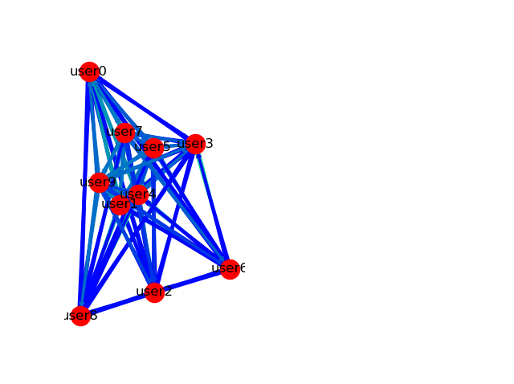
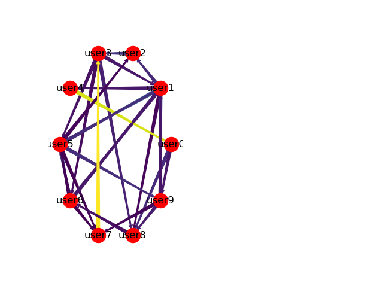

# DiscordSocialGraph

Statistical and Machine Learning project for discovering and analysing social structures on Discord. 

## Methodology

Data is collected using [my cog](https://github.com/samclane/Snake-Cogs/blob/master/member_logger/member_logger.py) 
for [RedDiscordBot](https://github.com/Cog-Creators/Red-DiscordBot). 

The data collected is rather simple. Only 2 user actions are tracked: joining a server and mentioning users in a message.
The data is stored in a `csv` file, looking like the following:

```csv
timestamp,member,present
1538780281,user9,"['user4', 'user6']"
1538780523,user9,"['user7', 'user0', 'user5', 'user1', 'user3', 'user8', 'user2', 'user6']"
1538781457,user0,"['user4', 'user3']"
1538782163,user1,['user9']
1538782577,user8,['user3']
1538782852,user7,"['user0', 'user4', 'user8', 'user5', 'user3']"
1538782998,user1,"['user9', 'user2', 'user3', 'user7', 'user4']"
1538783891,user0,"['user7', 'user5', 'user3', 'user4', 'user8', 'user1']"
1538784016,user5,"['user2', 'user1']"
...
```

The `member` is the user performing the action, and `present` are either the users already in the server, or users 
mentioned in the message.

As enough real-life data hasn't been collected yet, a method to generate data has been created. `generate_samples.py` will
create dummy data to train the model on. `generate_samples.py A B` allows you to create A samples for a server with B 
members. The data generator also selects a few members to be "friends", which biases the data in order to put the 2 users
together more often. 

Sample:
```
$ python generate_samples.py 5000 10 data.csv
Created 10 members.
Generating friends...
user2 and user3 are friends with weight .70
user7 and user3 are friends with weight .92
user4 and user0 are friends with weight .82
user4 and user0 are friends with weight .72
user4 and user0 are friends with weight .85
Generating samples
Data successfully generated!
------
           member                                            present
timestamp                                                           
1538780281  user9                                     [user4, user6]
1538780523  user9  [user7, user0, user5, user1, user3, user8, use...
1538781457  user0                                     [user4, user3]
1538782163  user1                                            [user9]
1538782577  user8                                            [user3]
1538782852  user7                [user0, user4, user8, user5, user3]
1538782998  user1                [user9, user2, user3, user7, user4]
...
[5000 rows x 2 columns]
Saving data to C:\Users\SawyerPC\PycharmProjects\DiscordSocialGraph\data.csv.
```

The data can then by processed by running `process_data.py`

```
$ python process_data.py data.csv
Reading C:\Users\SawyerPC\PycharmProjects\DiscordSocialGraph\data.csv...
Encoding data...
      user0  user1  user2  user3  user4  user5  user6  user7  user8  user9
0         0      0      0      0      1      0      1      0      0      0
1         1      1      1      1      0      1      1      1      1      0
2         0      0      0      1      1      0      0      0      0      0
3         0      0      0      0      0      0      0      0      0      1
4         0      0      0      1      0      0      0      0      0      0
5         1      0      0      1      1      1      0      0      1      0
6         0      0      1      1      1      0      0      1      0      1
7         0      1      0      1      1      1      0      1      1      0
8         0      1      1      0      0      0      0      0      0      0
9         0      0      0      1      1      1      0      1      1      1
...
[5000 rows x 10 columns]
Training classifier...
Done.
Building graph...
Done. Showing graph.
```

A social graph is then constructed, with weights consisting of the Gaussian Naive Bayes probability of that user interacting with given a 
neighbor N. The graph is then drawn:



A "noise floor" can be added to prune insignificant edges. A `noise_floor` of `.15` can be used by calling

```
python process_data.py data.csv -nf .15
```

Which produces the following graph:



Due to the complete randomness of the data generation methods, some "strong friendships" may occur naturally, dwarfing 
any intentional bias. 

The main objective is to find the "linchpin" of the server; that is, the node in the graph with the most incoming weight
, signifying they cause the server's population and interaction levels to increase the most. 
