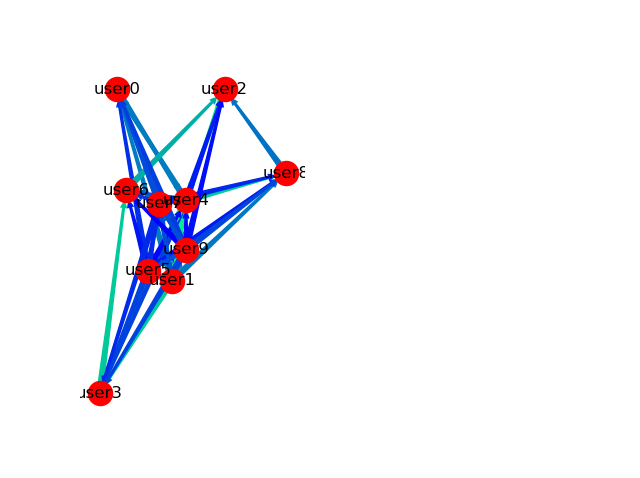

# DiscordSocialGraph

Statistical and Machine Learning project for discovering and analysing social structures on Discord. 

## Methodology

Data is collected using [my cog](https://github.com/samclane/Snake-Cogs/blob/master/member_logger/member_logger.py) 
for [RedDiscordBot](https://github.com/Cog-Creators/Red-DiscordBot). 

The data collected is rather simple. Only 2 user actions are tracked: joining a server and mentioning users in a message.
The data is stored in a `csv` file, looking like the following:

```csv
timestamp,member,present
1539291278,user3,"['user8', 'user1', 'user0', 'user7', 'user4', 'user6']"
1539291514,user1,"['user5', 'user0', 'user4', 'user2', 'user7', 'user8', 'user9', 'user6']"
1539292425,user0,"['user7', 'user5', 'user3', 'user9', 'user4']"
1539293267,user3,"['user4', 'user0', 'user2', 'user7', 'user6']"
1539293442,user9,['user8']
1539293609,user3,"['user6', 'user0', 'user7', 'user4']"
1539293634,user3,"['user0', 'user6', 'user5', 'user8']"
1539293848,user9,"['user6', 'user4', 'user0', 'user7']"
1539294307,user9,"['user6', 'user1', 'user0']"
1539294408,user6,"['user1', 'user4', 'user0', 'user7', 'user5', 'user2']"
1539295361,user6,"['user0', 'user1', 'user4', 'user3', 'user9', 'user2']"
...
```

The `member` is the user performing the action, and `present` are either the users already in the server, or users 
mentioned in the message.

As enough real-life data hasn't been collected yet, a method to generate data has been created. `generate_samples.py` will
create dummy data to train the model on. `generate_samples.py A B` allows you to create A samples for a server with B 
members. The data generator also selects a few members to be "friends", which biases the data in order to put the 2 users
together more often. 

Sample:
```
$ python generate_samples.py 5000 10 data.csv
Created 10 members.
Generating friends...
user2 and user4 are friends with weight .93
user0 and user4 are friends with weight .92
user3 and user6 are friends with weight .99
user8 and user2 are friends with weight .91
user6 and user2 are friends with weight .98
Generating samples
Data successfully generated!
------
           member                                            present
timestamp                                                           
1539291278  user3         [user8, user1, user0, user7, user4, user6]
1539291514  user1  [user5, user0, user4, user2, user7, user8, use...
1539292425  user0                [user7, user5, user3, user9, user4]
1539293267  user3                [user4, user0, user2, user7, user6]
1539293442  user9                                            [user8]
1539293609  user3                       [user6, user0, user7, user4]
...
[5000 rows x 2 columns]
Saving data to C:\Users\SawyerPC\PycharmProjects\DiscordSocialGraph\data.csv.
```

The data can then by processed by running `encode_and_train.py`

```
$ python encode_and_train.py data.csv
Reading C:\Users\SawyerPC\PycharmProjects\DiscordSocialGraph\data.csv...
Encoding data...
   user0  user1  user2  user3  user4  user5  user6  user7  user8  user9
0         1      1      0      1      1      0      1      1      1      0
1         1      1      1      0      1      1      1      1      1      1
2         1      0      0      1      1      1      0      1      0      1
3         1      0      1      1      1      0      1      1      0      0
4         0      0      0      0      0      0      0      0      1      1
5         1      0      0      1      1      0      1      1      0      0
6         1      0      0      1      0      1      1      0      1      0
7         1      0      0      0      1      0      1      1      0      1
8         1      1      0      0      0      0      1      0      0      1
9         1      1      1      0      1      1      1      1      0      0

...
[5000 rows x 10 columns]
Training svm...
Cross-validation SVC : [ 0.369   0.3315  0.347   0.326   0.3165]
Done.
Building graph...
In-degree weight sums:
[('user8', 0.9723977805015738), ('user3', 0.9566272749998164), ('user0', 0.9558614388968902), ...]
Done. Showing graph.
```

A social graph is then constructed, with weights consisting of the SVM probability of that user interacting with given a 
neighbor N. The graph is then drawn:


A "noise floor" can be added to prune insignificant edges. A `noise_floor` of `.09` can be used by calling

```
python encode_and_train.py data.csv -nf .09
```

Which produces the following graph:



Due to the complete randomness of the data generation methods, some "strong friendships" may occur naturally, dwarfing 
any intentional bias. 

The main objective is to find the "linchpin" of the server; that is, the node in the graph with the most incoming weight
, signifying they cause the server's population and interaction levels to increase the most. 

If you have a map between Discord user-IDs and usernames, you can provide it as csv file with the `-n <FILENAME>` or 
`--names <FILENAME>`

Using the `-s <FILENAME>` or `--save_file <FILENAME>` option, you can output the graph data as a `.graphml` file.

After the social graph is displayed, the Receiver Operating Characteristic (ROC) graph will be calculated and displayed. 
This gives the relationship between the True Positive Rate (TPR) and False Positive Rate (FPR), gauging if the model 
performs better than random chance. Here is the ROC curve for our generated data. This indicates the model is performing 
exceptionally well on the dataset.

